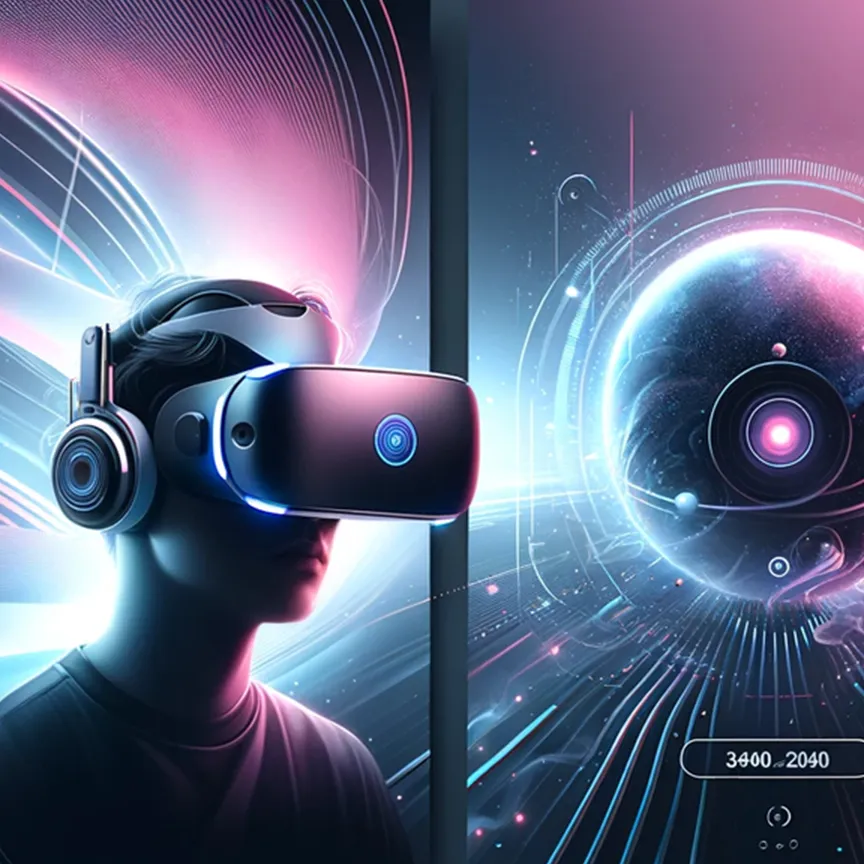
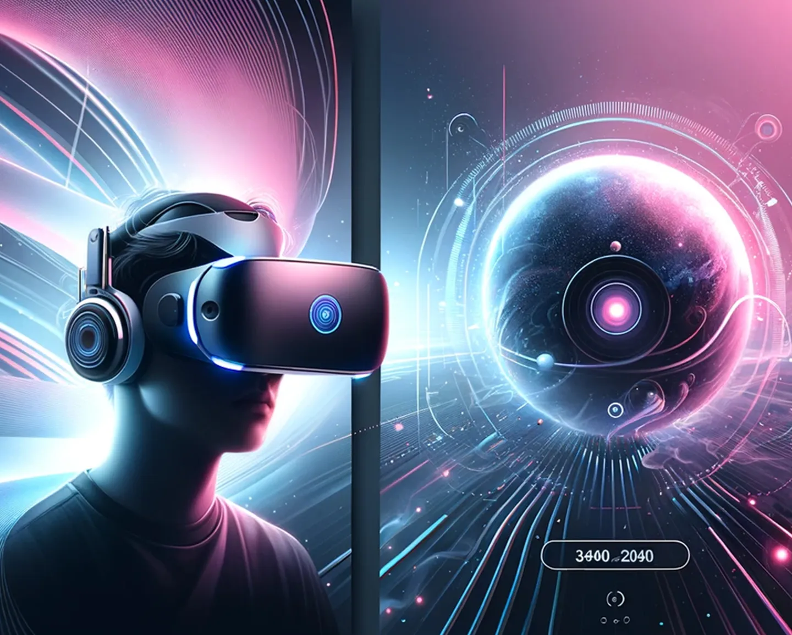

# 바닐라 JS 프로젝트 성능 개선

- url: https://front-4th-chapter4-2-basic-fawn.vercel.app/

## 성능 개선 보고서

### 원인과 해결 방안

### 1. 이미지 크기 및 포맷

- 압축률이 좋지 않은 JPG, PNG 형식을 사용하여 로드에 부담이 발생함.
- 이미지 크기가 명확하게 지정되지 않아 브라우저가 미리 크기를 정하지 못하고 **레이아웃 시프트(Layout Shift)** 가 발생할 가능성이 있음.
- 또한 실제 렌더링되는 이미지보다 너무 크게 width, height가 설정되어도 낭비 발생.
- 해결 방안:
  - `WebP`, `AVIF` 등 압축 효율이 높은 포맷을 사용하여 로드 속도를 개선.
  - `width`와 `height` 속성을 명시하여 레이아웃 시프트를 방지.

### 2. 이미지 로딩

- Hero 이미지와 같이 페이지에서 **즉시 보여야 하는 이미지**를 제외하고, 나머지 이미지는 **지연 로딩(lazy loading)** 을 적용할 필요가 있음.
- 해결 방안:
  - `loading="lazy"` 속성을 활용하여 사용자의 뷰포트에 들어올 때 로드되도록 설정.

### 3. 웹폰트 불러오기

- 웹폰트 로드는 추가적인 네트워크 요청을 발생시키므로 성능 저하의 원인이 될 수 있음.
- 해결 방안:
  - 중요한 텍스트는 **시스템 폰트**를 사용하여 첫 로딩 속도를 개선.

### 4. 자바스크립트 실행 순서

- Cookie 관련 스크립트는 문서의 렌더링과 직접적인 관련이 없음.
- 해결 방안:
  - `<script async>` 속성을 사용하여 문서 파싱을 차단하지 않도록 설정.

---

### 성능 최적화 전후 비교

#### 최적화 전


(page speed 화면은 캡처를 하지 못했으나 성능은 60 ~ 70 사이였다.)

#### 최적화 후


### 결론

**성능이 약 36.1% 정도 개선**됨

## 질문

**1.sizes, srcset 을 사용해서 desktop 디바이스일때는 desktop 용 이미지만 로드되게 하려고 했는데 도전에 실패했습니다.**

```html

    
    
```
위와 같이 하면 이미지는 잘 불러와지는데 tablet, mobile 이미지도 가져옵니다
```html

``` 
위와 같이 srcset, sizes를 사용하면 class를 적용하지 못해서 미디어 쿼리가 제대로 적용이 안되고 class로 display를 조절하고 있기 때문에 이미지가 안보입니다.
```tsx
<picture>
<source srcset="images/Hero_Mobile.webp" media="(max-width: 576px)" class="mobile">
<source srcset="images/Hero_Tablet.webp" media="(max-width: 960px)" class="tablet">

</picture>
```
위와 같이 하면 source에서는 class가 작동하지 않아서 데스크탑 이미지만 보입니다. 어떻게하면 이 상황을 해결할 수 있을까요?


**2.이미지의 적절한 width, height 정하기**
   
  이번 과제에서 가장 고민스러웠던 것은…
  ```tsx
   
  ```
  img의 width, height를 정하는 일이었습니다.
  
  실제 디바이스에서 필요한 이미지 사이즈보다 무조건 작게 가져가야 이득인걸까요?
  
  이미지 사이즈는 누가,어떻게 정하나요?
  
  이미지 사이즈를 미리 지정했다고해도 후에 css에 의해 조정되면 이것도 CLS의 원인이 될 수 있지는 않을지…

**3.모바일 디바이스에서의 성능 최적화가 너무 어렵습니다. 데스크탑과 모바일에서 성능 차이가 나는 원인엔 무엇이 있을 수 있을까요?**
